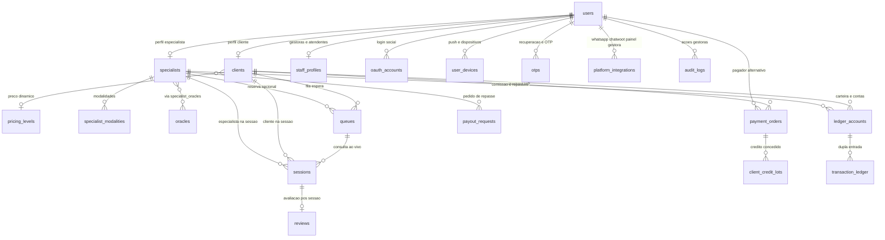

# API REST — Plataforma Fadas do Bem

Pacote **`fadasdobem--api`** (Node.js, Express, Sequelize e PostgreSQL). Este ficheiro é a **entrada oficial** ao repositório da API para execução local, visão da estrutura de código e **contrato técnico consolidado da Fase 1** (domínio de dados).

---

## Requisitos e execução

| Item | Detalhe |
|------|---------|
| **Runtime** | Node.js **≥ 18** |
| **Base de dados** | PostgreSQL (configuração via `.env`; ver `.env.example`) |
| **Instalação** | `npm install` |
| **Variáveis** | Copiar `.env.example` → `.env` e preencher segredos e URLs |

```bash
cp .env.example .env
# Ajustar PostgreSQL, JWT, Redis (se utilizado em fases seguintes), etc.

npm run start       # Produção/simples
npm run dev         # Reload com node --watch
```

A porta padrão é **`3000`** (`PORT` no `.env`). Probes típicos: `GET /health`, `GET /ping`; rotas da API agrupadas em **`/api/*`** — por exemplo **`GET /api/v1/health`**.

Para smoke tests HTTP, coleções exemplo em **`src/postman/`**.

---

## Organização do código-fonte (`src/`)

Para **separação de preocupações** e **manutenibilidade**:

- **`src/providers`** — Integrações externas (clientes HTTP, SDKs Anthropic/OpenAI, Resend/e-mail, Chatwoot, Evolution API). Adaptação de protocolos e formatos **sem** regra de negócio central do domínio.
- **`src/features`** — Casos de uso e módulos de negócio (autenticação, webhook Chatwoot/IA, etc.). Dependências apenas no sentido **feature → provider**, não o inverso.
- **`src/documentacao`** — Documentação mantida ao lado da implementação. A especificação **campo a campo** do modelo persistido encontra-se em **`src/documentacao/models/`** e em **`Relacionamentos_FKs.md`** (ver também [Documentação complementar](./src/documentacao/README.md)).
- **`src/config`**, **`src/middlewares`**, **`src/utils`**, **`src/models`** — Configuração, cruzamentos HTTP transversais, utilitários e modelos Sequelize alinhados ao esquema.

---

## Contrato técnico — Fase 1 (modelo de dados)

Formaliza modelo relacional, função de cada entidade núcleo no domínio da aplicação e decisões de modelagem tratadas como invariantes para evoluções posteriores. O desenho privilegia **alta disponibilidade** e suporte transacional à **fila de atendimento**, ao **cronômetro de consultas** com política comercial **2+X+2**, e a uma **camada financeira integrada ao Mercado Pago**, com rastreabilidade de cobrança e governança de saldo compatível com **LGPD**.

Artefatos sob **`src/features`**, **`src/providers`** e **`src/models`** permanecem obrigados à consistência com este contrato.

### Diagrama macro (ERD)

Ambientes compatíveis com Mermaid renderizam o bloco diretamente.



### Dicionário de dados consolidado

|Tabela|Papel no negócio|
|------|------------------|
|**`users`**|Identidade única da plataforma (login, papéis, LGPD/versionamento de aceite e cadastro macro). Une clientes, tarólogas, gestoras e atendentes no mesmo núcleo de autenticação.|
|**`oauth_accounts`**|Vínculo com provedores de login federado sem perder relação única com a conta principal.|
|**`user_devices`**|Registro de aparelhos e tokens para notificações (push), com auditoria por dispositivo.|
|**`staff_profiles`**|Dados corporativos de **Gestoras** e **Atendentes**, separados do perfil público de clientes e especialistas.|
|**`clients`**|Perfil da **cliente** com dados progressivos de cadastro (inclui endereços e LGPD sócio-técnica via `users`) e vínculo com **níveis de precificação** e exceções comerciais acordadas com a Gestora.|
|**`specialists`**|Perfil público-operacional das **tarólogas**, incluindo vitrine (bio, PIX), disponibilidade, integrações (**Chatwoot**, **Intelbras**, **Agora**) e **trava de pré-reserva** para evitar conflitos no checkout.|
|**`specialist_modalities`**|Define quais canais (**texto**, **voz**, **vídeo**) cada especialista atende, alimentando matching e filas.|
|**`oracles`** e **`specialist_oracles`**|Catálogo editorial de **oráculos** e vínculos N:M com as especialistas, para vitrine filtrável e relatórios.|
|**`pricing_levels`**|Camada de **preço dinâmico**, separando **tarifa texto/voz** e **tarifa vídeo**, com promoções aplicáveis (ex.: primeira consulta).|
|**`queues`**|Representa clientes **em espera** para entrada na consulta ao vivo (com especialista opcional ou fila inteligente).|
|**`sessions`**|Momento econômico central: **cronômetro**, modalidade (**2+X+2**), snapshots de **valor por minuto** e **motivo de encerramento**, integrações ao vivo e trilha mágica (**magic link**) para sala segura.|
|**`reviews`**|Avaliação **pós-consulta** ligada unicamente à sessão, com moderação possível pela Gestora.|
|**`payment_orders`**|Pedido de cobrança e **snapshot completo Mercado Pago** (PIX, cartão, status crus, NFS-e onde aplicável); âncora de **idempotência** para webhooks.|
|**`client_credit_lots`**|Pacotes (**avulso** vs **sessão única**) com eventual **expiração**, financiamento rastreado até o pagamento original.|
|**`ledger_accounts`**|Carteiras lógicas (cliente, especialista, plataforma etc.) onde se acumula e reconcilia saldo econômico.|
|**`transaction_ledger`**|Razão em **partidas dobradas** — cada lançamento com débito e crédito explícitos, evitando “furos” contábeis.|
|**`payout_requests`**|Formalização dos **pedidos de repasse (saque PIX)** solicitados pelas especialistas e processados pela operação.|
|**`otps`**|Fluxos seguros de **OTP** para recuperação e verificações sensíveis, com limites de tentativa.|
|**`audit_logs`**|Trilhas de decisões da **Gestora** sobre o sistema (*quem mudou o quê, quando*, com deltas), essencial para auditoria e segurança operacional.|
|**`platform_integrations`**|Centraliza no banco os **credenciais, status de conexão e QR Codes** geridos pelo Painel (**WhatsApp Evolution API** + **Chatwoot** global/config). Habilita proxy administrativo pela API sem depender de ferramentas externas manuais no dia a dia da cliente.|

### Decisões arquiteturais críticas

- **Transações de dupla entrada (Ledger)** — Cada movimentação econômica relevante é representada simultaneamente como **saída** de uma conta e **entrada** em outra, com valores auditáveis (`transaction_ledger`). A reconciliação com o esperado pela **Gestora** e pela **Financeira** fica garantida; evitam-se carteiras inexplicavelmente divergentes ou inconsistências que afetem cliente e reputação.

- **Cofre de webhooks (`raw_webhook_payload` em JSONB)** — Os retornos do **Mercado Pago** podem conter nuances ainda não mapeadas em colunas estruturadas. A persistência do **payload bruto** viabiliza **investigações forenses**, suporte, **chargebacks** e atualizações de integração sem perda de história de origem (“nenhum byte importante se perde quando o gateway evoluir”).

- **Índices parciais com *soft delete* (único apenas para linhas “vivas”)** — Com exclusão lógica compatível com **LGPD** (*soft delete*, `deleted_at` preenchido), **e-mails**, **CPFs** quando informados e outras chaves públicas não permanecem bloqueados indefinidamente apenas por registros inativos — permitindo novo cadastro legítimo alinhado ao consentimento sem travar onboarding indevido.

- **Snapshots financeiros na própria `sessions`** — **Preço por minuto** aplicado naquele ciclo de consulta e **percentuais de comissão** (e derivados econômicos associados à sessão) são **congelados no encerramento**. Alterações posteriores em preço ou comissões **não reescrevem o passado**, preservando relatórios, **compliance** e apuração de períodos encerrados.

---

## Referência campo a campo

A especificação detalhada (tipos, nulidade, regras e índices) está fragmentada em **`src/documentacao/models/`** (por exemplo `User.md`, `Session.md`, `PaymentOrder.md`) e **`src/documentacao/models/Relacionamentos_FKs.md`**. Alterações ao esquema físico devem refletir primeiro o modelo persistido e, na mesma entrega ou após migrações, estes artefatos.

---

*Escopo: **Fase 1 — modelo de dados**. Alterações de produto que impliquem mudanças de esquema ou invariantes de negócio devem atualizar primeiro o modelo persistido e, em seguida, este contrato.*
