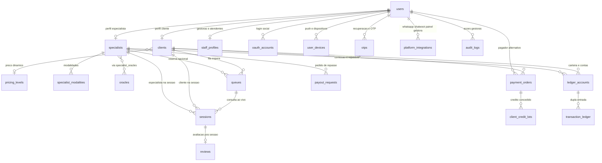

# 📖 Fadas do Bem - Arquitetura e Dicionário de Dados

---

## Visão executiva

Este documento **oficializa a fundação de dados da Fase 1** da plataforma **Fadas do Bem**. O modelo relacional foi desenhado para **alta disponibilidade**, suportando com segurança a **fila inteligente de atendimento**, o **cronômetro de consultas** (política comercial **2+X+2**), e uma **camada financeira integrada ao Mercado Pago** — com rastreamento ponta a ponta de cobrança, NFS-e automatizada onde aplicável e governança de saldo compatível com **LGPD**.

> **Espelho no GitHub:** a pasta **`/src/documentacao`** organiza materiais ao lado do mesmo repositório da API. Aqui, **`/models`** reflete diretamente o **banco de dados** (campos e tabelas). Em evoluções futuras, pastas paralelas (**`/features`** e correlatas) receberão descrições de produto correspondentes a cada módulo funcional da API — mantendo no GitHub um “mapa” claro entre **estrutura de dados**, **módulos** e **valor de negócio**.

---

## Diagrama macro (ERD)

O diagrama abaixo sintetiza as entidades núcleo e suas relações. No GitHub, ele é renderizado automaticamente a partir da sintaxe Mermaid.

---

## Dicionário de dados consolidado

|Tabela|Papel no negócio|
|------|------------------|
|**`users`**|Identidade única da plataforma (login, papéis, LGPD/versionamento de aceite e cadastro macro). Une clientes, tarólogas, gestoras e atendentes no mesmo núcleo de autenticação.|
|**`oauth_accounts`**|Vínculo com provedores de login federado sem perder relação única com a conta principal.|
|**`user_devices`**|Registro de aparelhos e tokens para notificações (push), com auditoria por dispositivo.|
|**`staff_profiles`**|Dados corporativos de **Gestoras** e **Atendentes**, separados do perfil público de clientes e especialistas.|
|**`clients`**|Perfil da **cliente** com dados progressivos de cadastro (inclui endereços e LGPD sócio-técnica via `users`) e vínculo com **níveis de precificação** e exceções comerciais acordadas com a Gestora.|
|**`specialists`**|Perfil público-operacional das **tarólogas**, incluindo vitrine (bio, PIX), disponibilidade, integrações (**Chatwoot**, **Intelbras**, **Agora**) e **trava de pré-reserva** para evitar conflitos no checkout.|
|**`specialist_modalidades`**|Define quais canais (**texto**, **voz**, **vídeo**) cada especialista atende, alimentando matching e filas.|
|**`oracles`** e **`specialist_oracles`**|Catálogo editorial de **oráculos** e vínculos N:M com as especialistas, para vitrine filtrável e relatórios.|
|**`pricing_levels`**|Camada de **preço dinâmico**, separando **tarifa texto/voz** e **tarifa vídeo**, com promoções aplicáveis (ex.: primeira consulta).|
|**`queues`**|Representa clientes **em espera** para entrada na consulta ao vivo (com especialista opcional ou fila inteligente).|
|**`sessions`**|Momento econômico central: **cronômetro**, modalidade (**2+X+2**), snapshots de **valor por minuto** e **motivo de encerramento**, integrações ao vivo e trilha mágica (**magic link**) para sala segura.|
|**`reviews`**|Avaliação **pós-consulta** ligada unicamente à sessão, com moderação possível pela Gestora.|
|**`payment_orders`**|Pedido de cobrança e **snapshot completo Mercado Pago** (PIX, cartão, status crus, NFS-e onde aplicável); âncora de **idempotência** para webhooks.|
|**`client_credit_lots`**|Pacotes (**avulso** vs **sessão única**) com eventual **expiração**, financiamento rastreado até o pagamento original.|
|**`ledger_accounts`**|Carteiras lógicas (cliente, especialista, plataforma etc.) onde se acumula e reconcilia saldo econômico.|
|**`transaction_ledger`**|Razão em **partidas dobradas** — cada lançamento com débito e crédito explícitos, evitando “furos” contábeis.|
|**`payout_requests`**|Formalização dos **pedidos de repasse (saque PIX)** solicitados pelas especialistas e processados pela operação.|
|**`otps`**|Fluxos seguros de **OTP** para recuperação e verificações sensíveis, com limites de tentativa.|
|**`audit_logs`**|Trilhas de decisões da **Gestora** sobre o sistema (*quem mudou o quê, quando*, com deltas), essencial para auditoria e segurança operacional.|
|**`platform_integrations`**|Centraliza no banco os **credenciais, status de conexão e QR Codes** geridos pelo Painel (**WhatsApp Evolution API** + **Chatwoot** global/config). Permite proxy administrativo pela API sem depender de ferramentas externas manuais no dia a dia da cliente.|

---

## Decisões arquiteturais críticas *(nosso diferencial)*

- **Transações de dupla entrada (Ledger)** — Cada movimentação econômica relevante aparece simultaneamente como **saída** de uma conta e **entrada** em outra, com valores auditáveis (`transaction_ledger`). Isso garante reconciliação com o esperado pela **Gestora** e pela **Financeira**, e evita cenários onde a carteira “apareça” maior ou menor sem explicação (prevenindo saldo inexplicável e inconsistências graves que afetariam cliente e reputação).

- **Cofre de webhooks (`raw_webhook_payload` em JSONB)** — Os retornos do **Mercado Pago** podem revelar nuances que campos já mapeados ainda não cobrem. Persistir o **payload bruto** permite **investigações forenses**, suporte rápido, **chargebacks** e atualizações de integração sem perda da história de origem (“nenhum byte importante se perde quando o gateway evoluir”).

- **Índices parciais com *soft delete* (único apenas para linhas “vivas”)** — Ao excluir conta de forma compatível com **LGPD** (*soft delete*, `deleted_at` preenchido), **e-mails**, **CPFs** quando informados e outras chaves públicas não ficam eternamente bloqueadas no banco apenas por um registro lógico inativo — permitindo um **novo ciclo honesto da cliente**, sem violar o espírito do consentimento nem travar onboarding legítimo.

- **Snapshots financeiros na própria `sessions`** — **Preço por minuto** aplicado naquele ciclo de consulta e **percentuais de comissão** (e derivados econômicos associados à sessão) são **congelados no momento do fechamento**. Assim, alterações posteriores em tabelas de preço ou de comissões **não reescrevem o passado** nem corrompem relatórios, **compliance** ou **apuração retrospective** de períodos já encerrados.

---

## Onde encontrar o detalhamento por tabela

A listagem **campo a campo**, tipos, nulidade e observações de cada regra está nos arquivos individuais do diretório **`/src/documentacao/models/`** (por exemplo `User.md`, `Session.md`, `PaymentOrder.md`). Recomenda-se manter esse subdiretório como **contrato vivo** sempre que migrações ou novos fluxos alterarem colunas ou índices.

---

*Última camada atualizada na **Fase 1 — modelo de dados** da Fadas do Bem. Evoluções de produto devem atualizar primeiro o repositório e, na sequência, este espelho de documentação no GitHub.*
